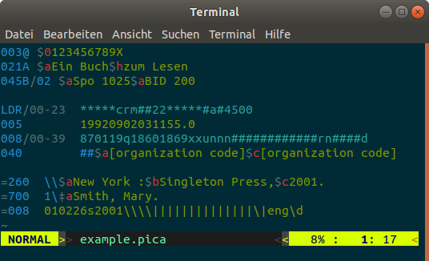

---
---

# Vim

On Unix-based systems copy [the syntax file `marc.vim`](marc.vim) to
`~/.vim/syntax/marc.vim` and add the following line to your `~/.vrimrc`:

~~~vi
au BufRead,BufNewFile *.{marc,mrc,mrk,pica,pp} set filetype=marc
~~~

The actual layout depends on your [vim color scheme](https://vimcolors.com/).

## Example

## Usage

After installation, syntax highlighting should be enabled by default for files
with extension `.marc`, `.mrc`, `.mrk`, `pica`, and `.pp`. To explicitly enable highlighting for the current file, try:

~~~vi
:set syntax=marc
~~~

Vim can also be used to highlight a file from command line with [vimcat] or
[vimpager].

[vimcat]: https://github.com/ofavre/vimcat
[vimpager]: https://github.com/rkitover/vimpager
